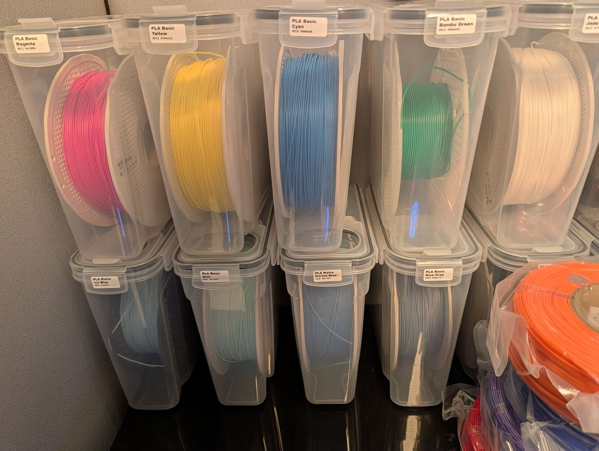

# Team31 Filament Tracker

Team31 Filament Tracker is an Android + web app for tracking filament spool inventory. The Android app reads NFC tags on compatible spools, and the web app provides a dashboard plus label printing support for a Fichero D11s thermal printer.



## Features

### Android App
- Read NFC tag data from supported filament spools
- Track spool status, notes, and usage
- Search and filter inventory
- Sync data with Firebase

### Web App
- View inventory in a dashboard
- Search and filter spools
- Print labels with a Fichero D11s printer
- Live site: [team31-filament-tracker.web.app](https://team31-filament-tracker.web.app)

## Repository Setup

```bash
git clone https://github.com/primemovers31/Team31-Filament-Tracker.git
cd Team31-Filament-Tracker
```

## Android Setup

Prerequisites:
- Android Studio
- JDK 17+
- A compatible Android phone with NFC

Firebase example setup:

```bash
npm install -g firebase-tools
firebase login
firebase projects:create your-project-id --display-name "Team31 Filament Tracker"
firebase apps:create android --project your-project-id --package-name com.bambu.nfc
firebase apps:sdkconfig android --project your-project-id --out app/google-services.json
```

Build and install:

```bash
./gradlew assembleDebug
./gradlew installDebug
```

## Web Setup

```bash
cd web
firebase login
firebase use your-project-id
firebase deploy --only hosting
```

## Notes

- `app/` contains the Android app.
- `web/` contains the Firebase-hosted web dashboard.
- `app/google-services.json` should stay out of version control.
